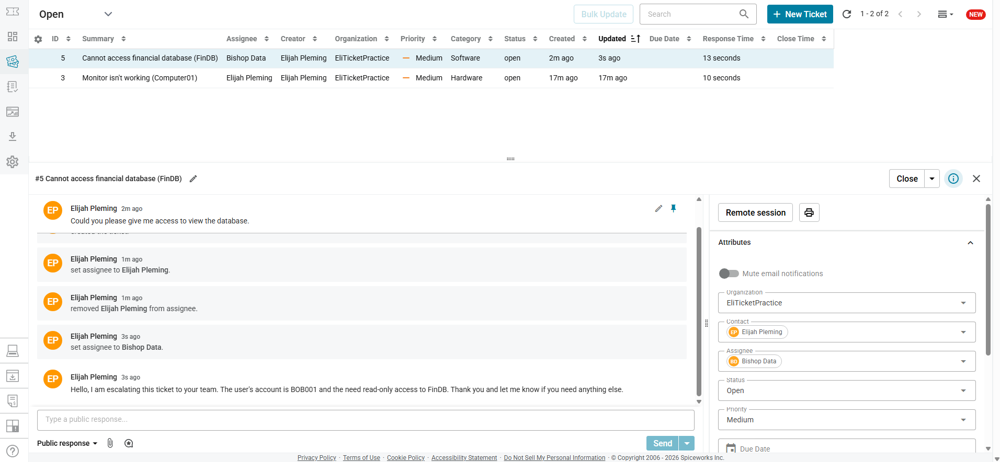

# Spiceworks Help Desk Ticketing Lab

## Status: Completed ✅

---

## Overview

This lab simulates real help desk workflows using Spiceworks, a free IT ticketing platform used by IT support teams to track, manage, and resolve user issues. The lab covers the full ticket lifecycle, from creation to resolution, as well as escalation procedures.

---

## Part 1 — Creating a Ticket

**Scenario:** A user submitted a ticket reporting that their second monitor stopped displaying anything.

**Ticket Details:**

| Field | Info |
|---|---|
| **Issue** | Second monitor not displaying |
| **Priority** | Medium |
| **Availability** | 10:00 AM – 10:30 AM (after meeting) |
| **Location** | 10th Floor |

**User's Description:**
> "My second monitor isn't working and is no longer displaying anything. I've tried turning it off and on and changing the source but it's still not working. It may need to be replaced."

**What I did:**
- Logged into Spiceworks and created a new help desk ticket
- Entered the user's issue description, availability window, and office location
- Set an appropriate priority level based on the impact to the user
- Assigned the ticket for follow-up
  

---

## Part 2 — Resolving and Closing a Ticket

**Scenario:** After investigating, the root cause was identified and resolved. The ticket was then properly documented and closed.

**Root Cause:** The user's WiFi certificate had expired and needed to be renewed through Active Directory.

**Resolution Steps:**
1. Identified the expired WiFi certificate as the root cause
2. Renewed the certificate through Active Directory on the backend
3. Confirmed resolution with the user
4. Updated ticket notes with full documentation
5. Closed the ticket with the appropriate resolution code

---

**Ticket Conversation Log:**

**Elijah Pleming** — *3m ago*
> "Hello, your WiFi certificate has expired and I just renewed it on the backend. Can you please check to see if it is working now?"

**Elijah Pleming** — *2m ago* *(user response)*
> "Yes, it's working now. Thank you!"

**Elijah Pleming** — *1m ago*
> Documented resolution steps in ticket notes: renewed the WiFi certificate through Active Directory.

**Elijah Pleming** — *48s ago*
> Changed status: **Open → Closed**

---

**Key Takeaways:**
- Always confirm resolution with the user before closing
- Document what the problem was, what caused it, and exactly how it was fixed
- Use the correct resolution code when closing so the ticket history is accurate and searchable

---

## Part 3 — Escalating a Ticket

**Scenario:** A user named Bob requested access to view a financial database. This required escalating to a team with the appropriate permissions.

**When to Escalate:**
- The issue requires permissions or access beyond your role
- The issue involves a specialized system (database, network infrastructure, security)
- The issue cannot be resolved at Tier 1 within a reasonable timeframe

**User's Request:**
> "Could you please give me access to view the financial database."

**Escalation Details:**

| Field | Info |
|---|---|
| **Ticket** | Database access request — Bob |
| **Escalated To** | Bishop (Database Administrators Team) |
| **Reason** | Granting database access is outside Tier 1 scope and requires a DBA with appropriate permissions |

**What to Include When Escalating:**
- User's name and contact info
- Clear description of the request or issue
- What steps were already taken at Tier 1
- Why escalation is needed
- Any urgency or business impact

**Key Takeaway:**
Knowing your limits is a core help desk skill. Escalating correctly — to the right team, with the right information — keeps issues moving and prevents delays for the user.

---

## Skills Demonstrated

- Help desk ticket creation and management in Spiceworks
- Root cause identification and resolution documentation
- User communication and confirmation before closing tickets
- Proper ticket closure with resolution codes
- Recognizing escalation triggers and routing tickets to the correct team
- Active Directory certificate management
